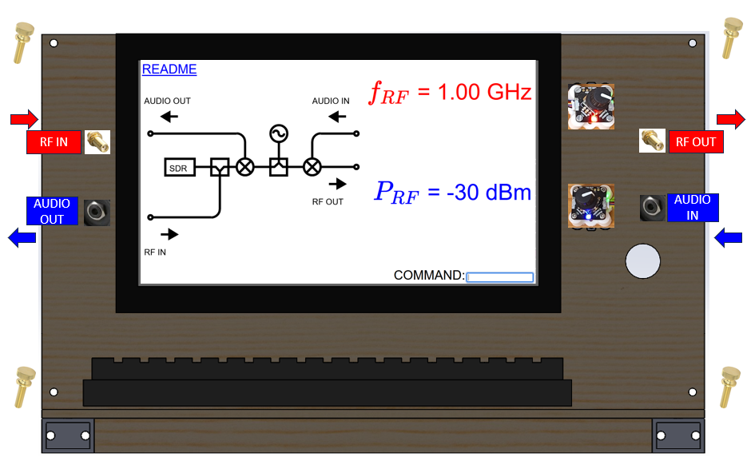
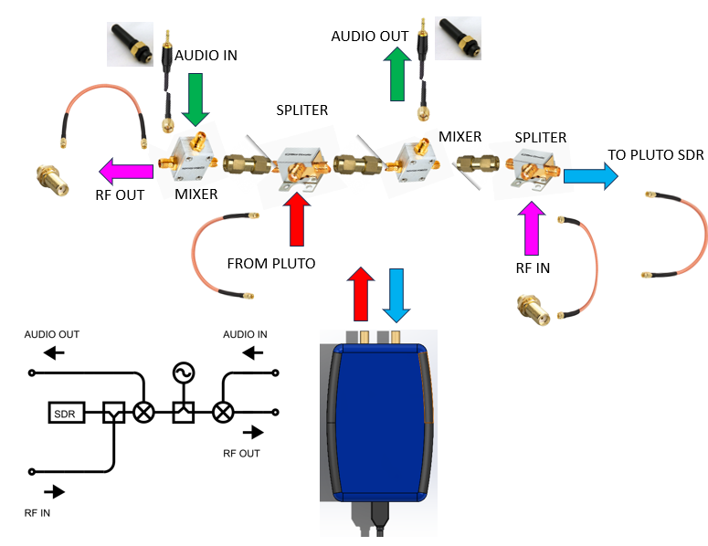
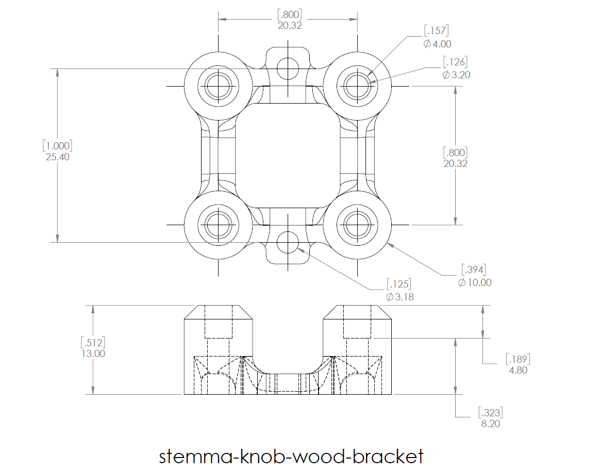
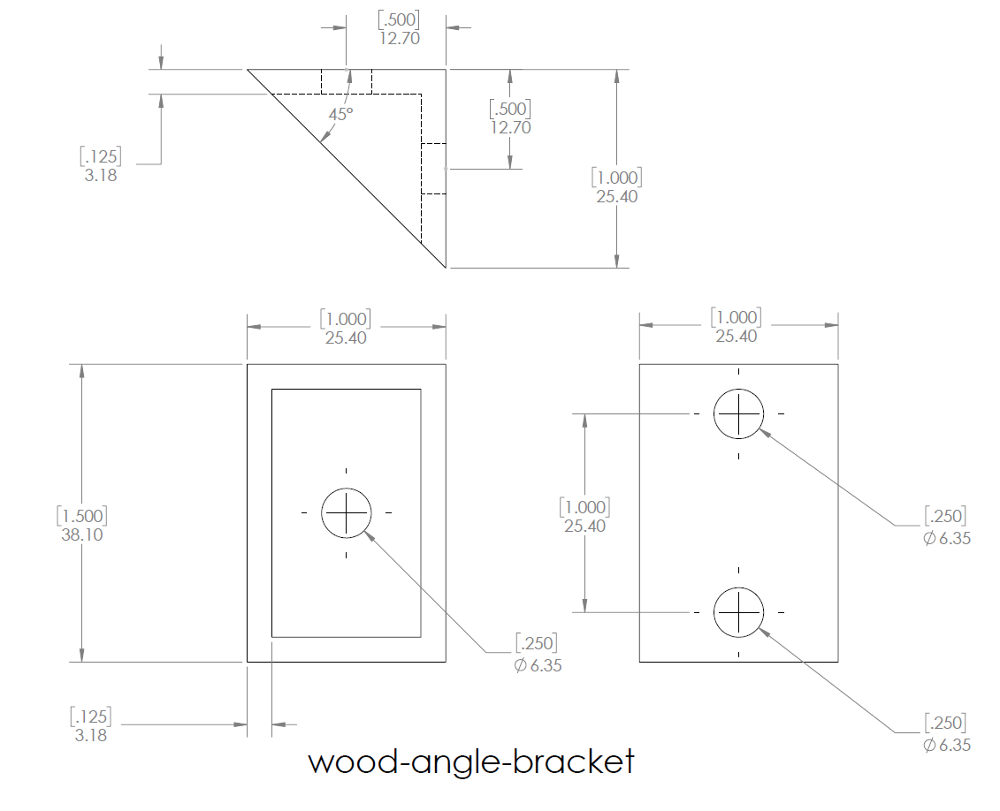
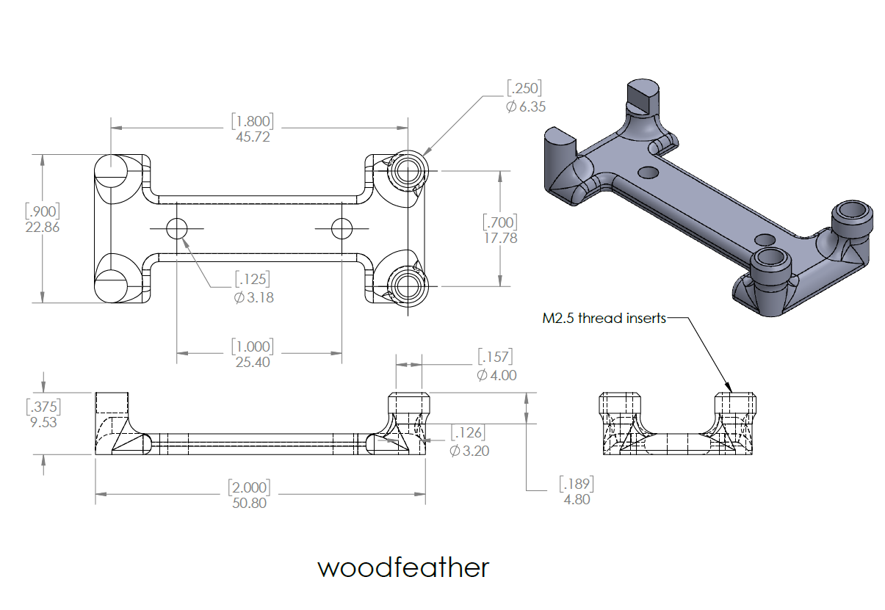
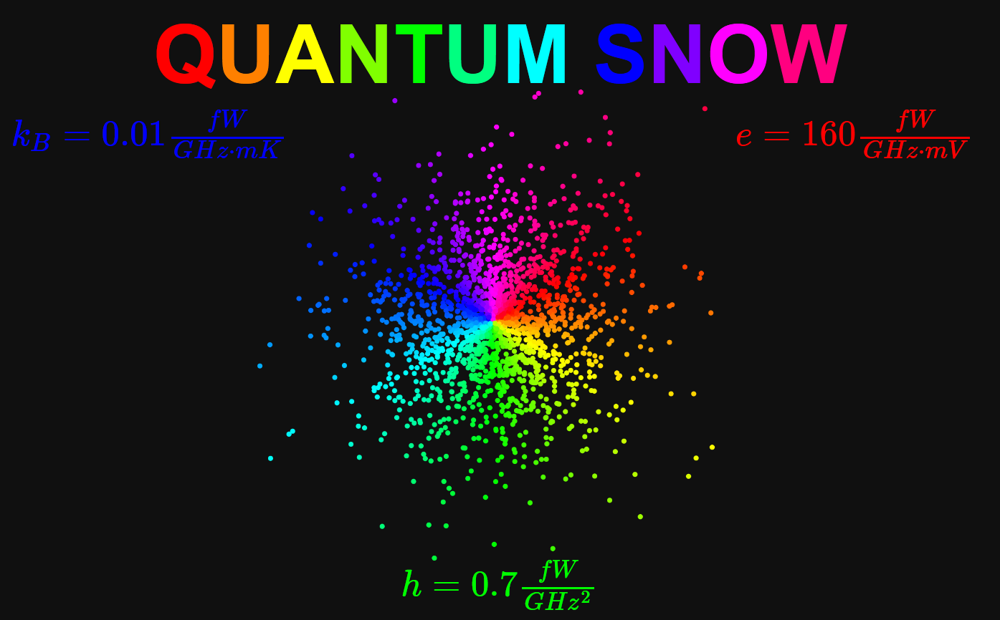
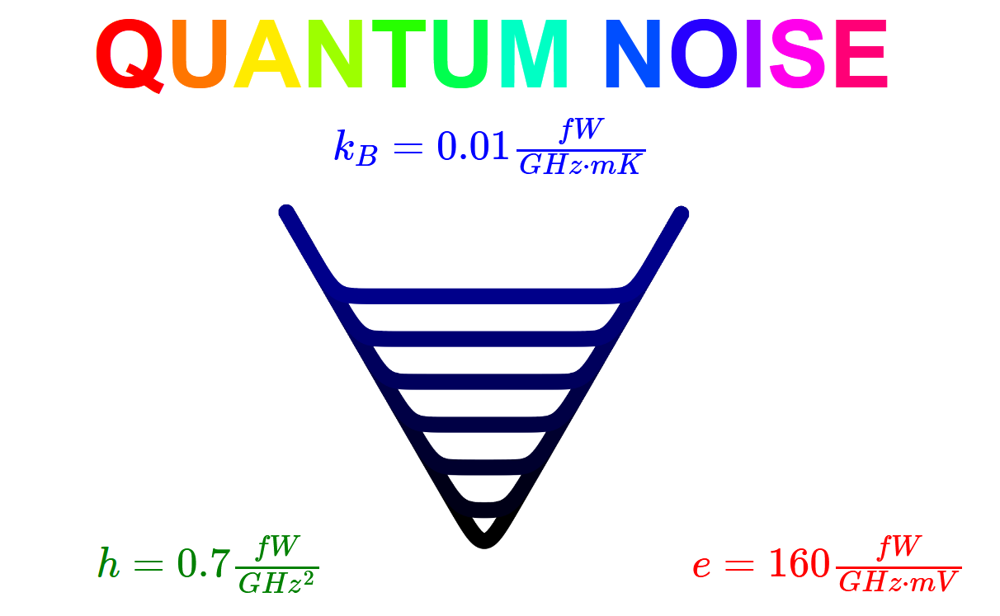

# NOISEOTRON

Open source instrument for measuring noise

 - [radio.html](radio.html)
 - [sinewave.html](sinewave.html)
 - [whitenoise.html](whitenoise.html)
 - [quantumnoisetriangle.html](quantumnoisetriangle.html)
 - [quantumsnow.html](quantumsnow.html)
 - [audiospectrum.html](audiospectrum.html)
 - [audiospectrum-2d.html](audiospectrum-2d.html)
 - [webeditor.html](webeditor.html)
 - [geometron/](geometron/)






# Bill of Materials

- [Adalm  Pluto SDR and RF source](https://www.analog.com/en/resources/evaluation-hardware-and-software/evaluation-boards-kits/adalm-pluto.html)
 - [Mini-Circuits ZFRSC-123-S+ 2 way Splitter DC-12 GHz, 50Ω x2](https://www.minicircuits.com/WebStore/dashboard.html?model=ZFRSC-123-S%2B)
 - [Mini-Circuits ZX05-C60-S+ Double Balanced Mixer x2](https://www.minicircuits.com/WebStore/dashboard.html?model=ZX05-C60-S%2B)
 - [Amphenol 132168 M-M SMA Barrel x3](https://www.digikey.com/en/products/detail/amphenol-rf/132168/1011917)
 - [SMA to 1/8" Audio Aux cable from Amazon x2](https://www.amazon.com/supmory-Stereo-Adapter-Antenna-Extension/dp/B0C9JBZ139/)
 - [Audio Panel Mount Feedthru(3/8" hole) x2](https://www.amazon.com/3-5mm-Stereo-Feed-Thru-Panel-Mount/dp/B004JX64FE/)
 - [8" SMA Cable x2](https://www.digikey.com/en/products/detail/crystek-corporation/CCSMA-MM-086-8/2683937)
 - [SMA Panel Mount Feedthru(1/4" hole) x2](https://www.digikey.com/en/products/detail/te-connectivity-linx/ADP-SMAF-SMAF-B-G/11314389)
 - [12"x24" pine board x2](https://www.amazon.com/AWIZOM-Unfinished-Wood-Pine-Rectangular/dp/B0CYQ5PZQX/)
 - [10-32 knurled brass thumb screw x4](https://www.mcmaster.com/92421A645/)
 - [13" wide HDMI Screen from Sunfounder x1](https://www.sunfounder.com/collections/displays-touchscreens-for-raspberry-pi/products/13inch-portable-gaming-monitor)
 - [USB A to C power cable x1](https://www.newegg.com/p/0S8-014F-00215)
 - [12 V to 5 V converter x1](https://www.newegg.com/p/36F-009H-002Z0)
 - [12 V barrel splitter x1](https://www.batteryeliminatorkits.com/product-p/1x2-splitter-cable-long.htm)
 - [Sparkfun QWIIC kit x1](https://www.sparkfun.com/products/15081)
 - [Raspberry Pi 5](https://www.digikey.com/en/products/detail/raspberry-pi/SC1110/24627138)
 - [narrow keyboard](https://www.amazon.com/SR-Keyboard-Multimedia-Computer-Laptop/dp/B01IQL2VCE/)
 - [mouse](https://www.amazon.com/TECKNET-6-Button-Ergonomic-Chromebook-Notebook-Grey/dp/B01BC4TXXC/)
 - [M2.5 Thread inserts](https://www.3djake.com/ruthex/threaded-insert-m25-70-pieces)
 - [M2.5 Screws](https://www.homedepot.com/p/Prime-Line-M2-5-0-45-x-8-mm-Metric-Zinc-Plated-Steel-Phillips-Drive-Pan-Head-Machine-Screws-25-Pack-9130839/311229788)
 - #4 wood screws()


## stemma-knob-wood-bracket.*



 - [3dprint/stemma-knob-wood-bracket.STL](3dprint/stemma-knob-wood-bracket.STL)
 - [3dprint/stemma-knob-wood-bracket.SLDPRT](3dprint/stemma-knob-wood-bracket.SLDPRT)
 - [3dprint/stemma-knob-wood-bracket.SLDDRW](3dprint/stemma-knob-wood-bracket.SLDDRW)
 - [3dprint/stemma-knob-wood-bracket.pdf](3dprint/stemma-knob-wood-bracket.pdf)






# Feather code

 - [All files that go in lib folder in lib.zip](circuitpython/lib.zip)
 - [code.py](circuitpython/code.py)

## Code.py

```

# SPDX-FileCopyrightText: 2021 John Park
# SPDX-License-Identifier: MIT

# I2C rotary encoder multiple test example.
# solder the A0 jumper on the second QT Rotary Encoder board
import time

import board
from adafruit_seesaw import seesaw, rotaryio, digitalio, neopixel
import usb_hid
from adafruit_hid.keyboard import Keyboard
from adafruit_hid.keyboard_layout_us import KeyboardLayoutUS
from adafruit_hid.keycode import Keycode
running = False
# The keyboard object!
time.sleep(1)  # Sleep for a bit to avoid a race condition on some systems
keyboard = Keyboard(usb_hid.devices)
keyboard_layout = KeyboardLayoutUS(keyboard)  # We're in the US :)


i2c = board.I2C()  # uses board.SCL and board.SDA
# i2c = board.STEMMA_I2C()  # For using the built-in STEMMA QT connector on a microcontroller

qt_enc1 = seesaw.Seesaw(i2c, addr=0x36)
qt_enc2 = seesaw.Seesaw(i2c, addr=0x37)

qt_enc1.pin_mode(24, qt_enc1.INPUT_PULLUP)
button1 = digitalio.DigitalIO(qt_enc1, 24)
button_held1 = False

qt_enc2.pin_mode(24, qt_enc2.INPUT_PULLUP)
button2 = digitalio.DigitalIO(qt_enc2, 24)
button_held2 = False

encoder1 = rotaryio.IncrementalEncoder(qt_enc1)
last_position1 = None

encoder2 = rotaryio.IncrementalEncoder(qt_enc2)
last_position2 = None

pixel1 = neopixel.NeoPixel(qt_enc1, 6, 1)
pixel1.brightness = 0.05
pixel1.fill(0xff0000)

pixel2 = neopixel.NeoPixel(qt_enc2, 6, 1)
pixel2.brightness = 0.02
pixel2.fill(0x0000ff)


while True:

    # negate the position to make clockwise rotation positive
    position1 = -encoder1.position
    position2 = -encoder2.position

    if position1 != last_position1:
        last_position1 = position1
        print("Position 1: {}".format(position1))
        keyboard_layout.write("red={}\n".format(position1))

    if not button1.value and not button_held1:
        button_held1 = True
        pixel1.brightness = 0.5
        print("Button 1 pressed")
        keyboard_layout.write("redpress\n")

    if button1.value and button_held1:
        button_held1 = False
        pixel1.brightness = 0.2
        print("Button 1 released")


    if position2 != last_position2:
        last_position2 = position2
        print("Position 2: {}".format(position2))
        keyboard_layout.write("blue={}\n".format(position2))

    if not button2.value and not button_held2:
        button_held2 = True
        pixel2.brightness = 0.5
        print("Button 2 pressed")
        keyboard_layout.write("bluepress\n")

    if button2.value and button_held2:
        button_held2 = False
        pixel2.brightness = 0.2
        print("Button 2 released")


```



